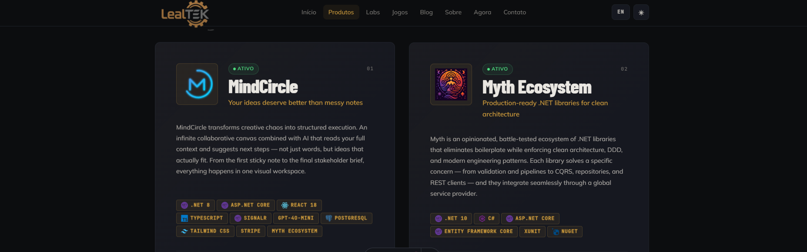
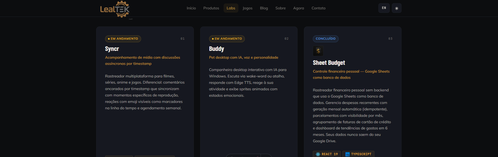
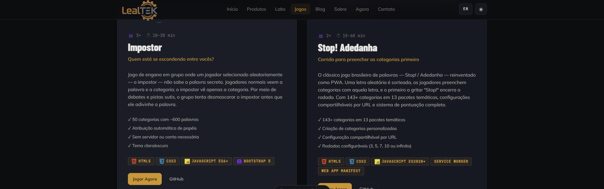
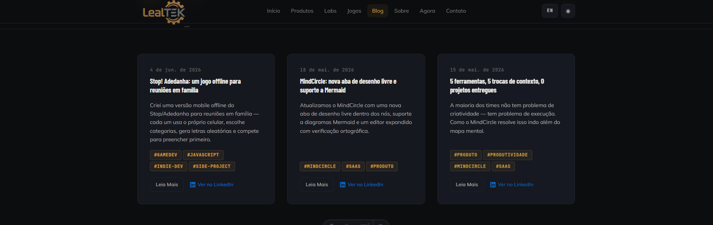
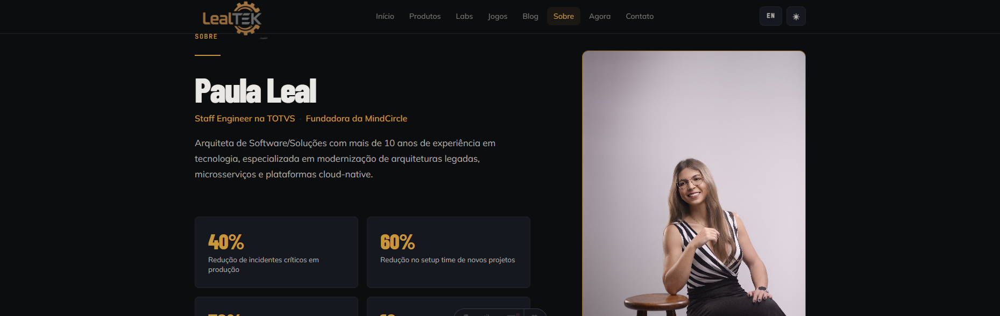
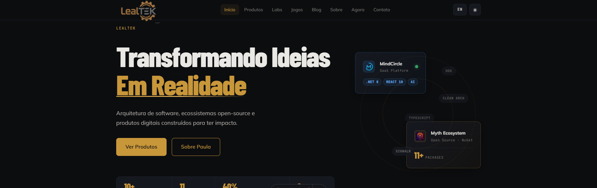

# LealTEK Web

Site institucional e portfólio de [Paula Leal](https://lealtek.com) — Staff Engineer na TOTVS e fundadora da MindCircle. Este não é apenas um site de apresentação: é um espaço que conecta arquitetura de software, produtos reais e projetos experimentais em uma narrativa coesa sobre o que significa construir com intenção.

Aqui você encontra os produtos que saíram do papel e estão em produção, os experimentos que nasceram da curiosidade, os jogos construídos por diversão (e que ensinam muito sobre a plataforma web), e os artigos que refletem anos de decisões técnicas no campo.

---

## O que você encontra aqui

### Produtos
Dois produtos em escalas diferentes — uma plataforma SaaS colaborativa e um ecossistema de bibliotecas .NET.



**[MindCircle](https://mindcircle.app)** — Workspace visual com IA para brainstorming, documentação e execução. Canvas colaborativo infinito, sugestões contextuais de IA e geração de documentos profissionais em um clique. Construído do zero como fundadora: da arquitetura à UI.

**[Myth Ecosystem](https://github.com/paulaolileal/myth)** — 12 pacotes NuGet para .NET com clean architecture, DDD e APIs fluentes. Nasceu da frustração com boilerplate repetitivo e evoluiu para um ecossistema battle-tested usado em produção.

---

### Labs
Projetos paralelos, provas de conceito e ferramentas construídas por curiosidade — alguns prontos, alguns em andamento, todos com algo útil para ensinar.



- **Syncr** — Rastreador multiplataforma de filmes, séries, anime e jogos com comentários ancorados por timestamp que sincronizam com momentos específicos de reprodução.
- **Buddy** — Companheiro desktop interativo com IA para Windows. Escuta via wake-word, responde com Edge TTS e exibe sprites animados com estados emocionais.
- **Sheet Budget** — Controle financeiro pessoal sem backend próprio: Google Sheets como banco de dados. Seus dados nunca saem do seu Drive.

---

### Jogos
Dois jogos para grupos no browser — sem instalação, sem conta, funciona offline. Nasceram de situações sociais reais e se tornaram estudos sólidos sobre o que a plataforma web nativa consegue fazer.



- **Impostor** — Jogo de engano onde um jogador não sabe a palavra secreta. O grupo debate pistas para desmascarar o impostor. 50 categorias, ~600 palavras, atribuição automática de papéis.
- **Stop! Adedanha** — O clássico brasileiro reinventado como PWA. 143+ categorias em 13 pacotes temáticos, configuração compartilhável por URL, 100% offline com Service Worker.

---

### Blog
Reflexões sobre arquitetura, cultura de engenharia e open-source — escritas para desenvolvedores, não para algoritmos.



Posts originados de experiências reais: modernizações de sistema legado, decisões de arquitetura, lançamentos de produto. Cada artigo tem link direto para o LinkedIn, onde a discussão continua.

---

### Sobre
A história por trás do trabalho: 10+ anos de experiência em tecnologia, de desenvolvedora web a Staff Engineer e fundadora.



---

## Stack técnica

| Camada | Tecnologia |
|---|---|
| Framework | [Astro v5](https://astro.build) — SSG, `output: static` |
| Estilo | Vanilla CSS com Custom Properties — sem Tailwind |
| Tipos | TypeScript strict |
| SEO | `@astrojs/sitemap` |
| i18n | Astro v5 built-in — PT (padrão) + EN (`/en/`) |
| Deploy | DigitalOcean App Platform |
| Domínio | [lealtek.com](https://lealtek.com) |

---

## Estrutura do projeto

```
src/
├── components/
│   ├── layout/     BaseLayout, Header, Footer
│   ├── ui/         Button, Badge, TechBadge
│   ├── sections/   ProductCard, GameCard, BlogPostCard
│   └── pages/      *Content.astro — conteúdo de cada página
├── content/
│   └── blog/       *.md — posts do blog
├── data/
│   ├── products.ts — MindCircle, Myth Ecosystem
│   ├── labs.ts     — Syncr, Buddy, Sheet Budget
│   └── games.ts    — Impostor, Stop! Adedanha
├── i18n/
│   ├── translations.ts — strings PT/EN
│   └── utils.ts        — getTranslations(locale)
├── pages/
│   ├── home, about, contact, labs, games
│   ├── products/index, mindcircle, myth
│   ├── blog/index, blog/[slug]
│   └── en/             — espelho PT em inglês
└── styles/
    └── global.css      — CSS vars, tipografia, utilitários
```

---

## Design system

Tema dark por padrão com toggle claro/escuro (salvo em `localStorage`).

**Paleta de cores:**
- Brand: `--gold-primary: #C8973A` · `--gold-light: #E0B05A`
- Backgrounds: `--bg: #0C0D0F` · `--bg-card: #161820`
- Tipografia: Barlow Condensed (headings) · Mulish (body) · JetBrains Mono (code/labels)



---

## Comandos

```bash
npm run dev       # servidor de desenvolvimento em localhost:4321
npm run build     # gera dist/ (output estático)
npm run preview   # preview local do dist/
```

---

## i18n

- PT-BR é o locale padrão (sem prefixo de URL)
- Inglês disponível em `/en/...`
- Blog somente em PT — `/en/blog` aponta para o índice
- Strings centralizadas em `src/i18n/translations.ts`

Para adicionar uma nova string:
1. Adicionar a chave em `translations.ts` nos objetos `pt` e `en`
2. Usar no componente: `const t = getTranslations(Astro.currentLocale); t.secao.chave`

---

## Adicionando conteúdo

**Novo post no blog** — criar `src/content/blog/meu-slug.md`:
```yaml
---
title: "Título do post"
date: 2026-06-19
excerpt: "Resumo para o card"
tags: [tag1, tag2]
linkedinUrl: "https://www.linkedin.com/feed/update/urn:li:ugcPost:XXXX"
linkedinEmbedSrc: "https://www.linkedin.com/embed/feed/update/urn:li:ugcPost:XXXX?collapsed=1"
featured: false
---
```

**Novo produto ou lab** — editar `src/data/products.ts` ou `src/data/labs.ts`. A tipagem TypeScript orienta os campos obrigatórios.

---

## Deploy

- **Plataforma:** DigitalOcean App Platform
- **Build command:** `npm run build`
- **Output dir:** `dist`
- **Node:** 20+
